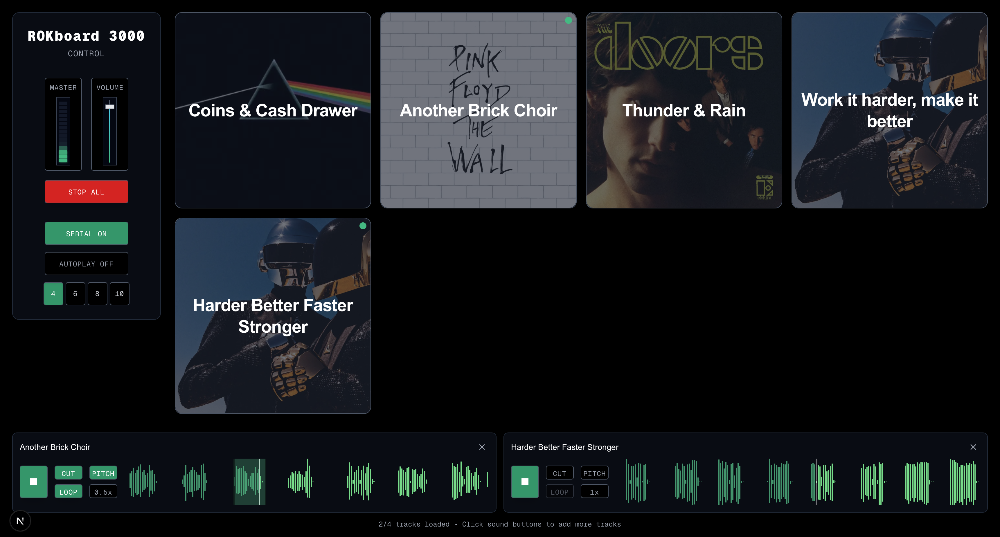

# ROKBoard 3000

Soundboard for band's live performances with custom sound effects and advanced audio controls.

*Built in < 10 hours using Claude Code*



## Description

Web-based soundboard with master volume control, responsive design, and high-quality audio playback. Features real-time waveform visualization, volume analysis, pitch-preserved speed control, and professional audio manipulation tools for live performances.

## Features

### 🎛️ **Audio Control**
- **Master Volume Control** - Global volume with VU meter visualization
- **Individual Track Control** - Up to 4 simultaneous tracks in serial mode
- **Region-based Playback** - Cut specific sections and loop them
- **Speed Control** - 0.25x to 2.0x playback speed with 5 preset options
- **Pitch Preservation** - Toggle to maintain or shift pitch when changing speed

### 🎵 **Live Performance Tools**
- **Serial Mode** - Queue up to 4 tracks for seamless performance
- **Autoplay** - Automatic track progression
- **STOP ALL** - Emergency stop for all playing tracks
- **Responsive Grid** - 4-10 column layouts for different screen sizes

### 🎨 **Visual Features**
- **Real-time Waveform** - Interactive audio visualization
- **VU Meter** - Master audio level monitoring
- **Compact Interface** - Optimized for live performance use

## Tech Stack

- **Next.js 14** - React framework
- **TypeScript** - Type safety
- **Tailwind CSS** - Styling
- **Web Audio API** - Audio playback
- **WaveSurfer.js v7** - Advanced audio waveform visualization and manipulation

## Configuration

1. **Installation**:
   ```bash
   npm install
   npm run dev
   ```

2. **Add sounds**: Place audio files (MP3, WAV, OGG) in `public/sounds/`

3. **Update library**: Edit `soundLibrary` array in `src/app/page.tsx`

4. **Live setup**: Connect audio output to mixer line input

## License

MIT License - free to use and modify