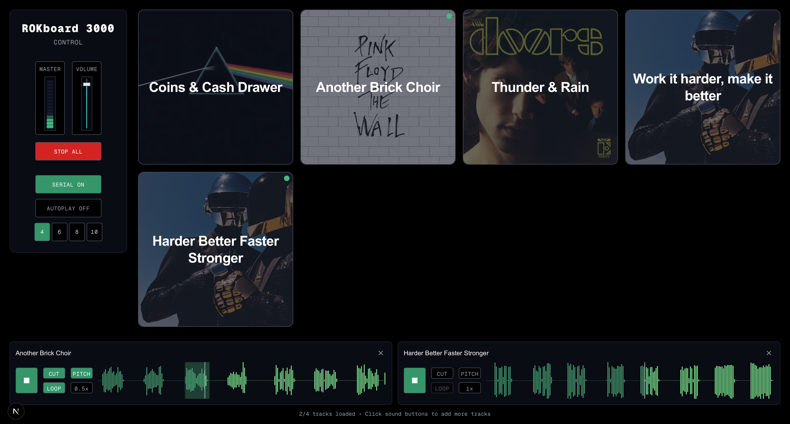

# ROKBoard 3000

Soundboard for band's live performances with custom sound effects and advanced audio controls.

*Built in < 10 hours using Claude Code*



## Description

Static web soundboard. 86 sounds across 5 categories. **Simple mode** plays one sound per tap;
**advanced mode** loads up to 4 tracks into a waveform player with region CUT/LOOP, 0.25x–2x
speed, and pitch preservation. Plus master volume with VU meter, STOP ALL, autoplay, and a
4–10 column responsive grid.

## Tech Stack

Next.js 15 (App Router, static export) · React 19 · TypeScript · Tailwind v4 ·
WaveSurfer.js v7 · Web Audio API

## Commands

```bash
npm install
npm run dev      # dev server
npm run build    # static export -> out/
npm run lint
npm run images   # downscale public/images to fit 400x400
```

## Adding sounds

1. Drop the `.mp3` in `public/sounds/<category>/` — folder name is the category id
   (`samples`, `vocals`, `fx`, `brainfarts`, `loops`).
   Convert first if needed: `ffmpeg -i in.wav -c:a libmp3lame -b:a 256k out.mp3`
2. Name it URL-safely: letters, digits, `_`, `.`, `-` only. No spaces or commas — static host.
3. Add an entry to `src/data/sounds.json`:

```json
{
  "id": "lil-jon-yeah",
  "name": "Lil Jon YEAH",
  "artist": "Lil Jon",
  "url": "/sounds/vocals/Lil_Jon_YEAH.mp3",
  "category": "vocals",
  "imageSrc": "/images/lil-jon-yeah.jpg"
}
```

`id` must be unique. `imageSrc` is optional — without it the sound uses its category gradient
from `src/data/categories.json`.

## Adding images

Drop in `public/images/`, point `imageSrc` at it, run `npm run images`. Fits everything inside
400×400 and re-encodes as JPEG; skips what's already small, so it's safe to re-run.
**Rewrites in place** — keep originals elsewhere. Flags: `--dry`, `--max 800`.

## Deployment

Push to `main` → GitHub Actions builds a Docker image serving `out/` from nginx.
For live use: connect audio output to mixer line input.

## License

MIT License - free to use and modify
